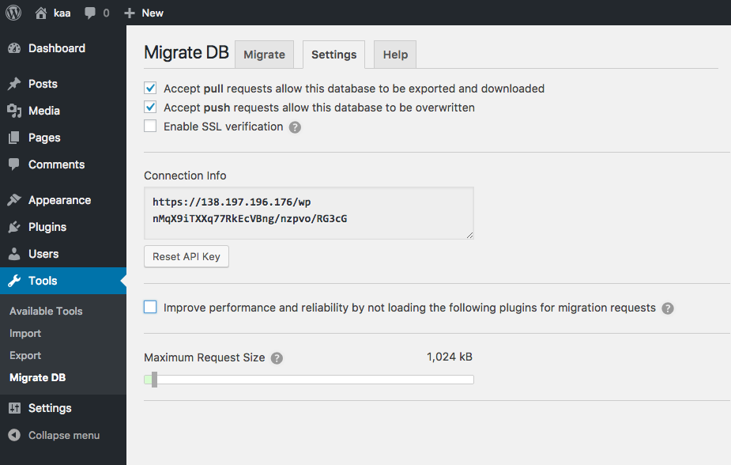

# Syncing Dev, Staging, and Production Environments

Keeping things synced between environments is tricky and there are a couple ways to do it. This walk-through just covers the most basic setup where you have a production site that the client has access to where they can add/update content and you work on a local version for development and testing.

## Tools of the trade

- [WP Sync DB](https://github.com/wp-sync-db/wp-sync-db) - Push, pull, and sync database tables between WordPress installations
- [WP Sync DB Media Files](https://github.com/wp-sync-db/wp-sync-db-media-files) - Sync media libraries between WordPress installations

**Note:** These are an older, open source version of [WP Migrate DB Pro](https://deliciousbrains.com/wp-migrate-db-pro/).

## Initial plugin setup

Activate the WP Sync DB and WP Sync DB Media Files plugins both on production and your development environment if you haven't already.

### 1. Get API Key from Production

Log in to Production and navigate to "Tools", then "Migrate DB" in the left-hand menu.

Click the "Settings" tab and do the following:

1. Check the "Accept pull requests…" option.
1. Check the "Accept push requests…" option.
1. Copy the link in the "Connection Info" box.

Now the plugin is able to receive a database update from an external site (our Development site)

### 2. Add API Key to Development

Log in to Development and navigate to "Tools", then "Migrate DB" in the left-hand menu.

On the "Migrate" tab and do the following:

1. Choose the “Push” option.
1. Paste the production site’s connection info into the text area that appears (what we copied in the previous step).
1. Under Advanced options:
	- Uncheck the “Replace GUIDs” option.
	- Check the “exclude spam comments” option.
1. Check the “Backup the remote database before replacing it” option.
1. Check the “Media Files” option.
1. Check the “Save Migration Profile” option and create a name so you can quickly push changes to production.

Once all these settings have been updated, click the “Migrate DB & Save” button.

## Workflows

### Pull from Production

### Push to Production

**DANGER ZONE!**

**IMPORTANT:** The default database migration moves everything, including the `wp_users` table. This means that the username and password of the WordPress users are also migrated. So after migrating from development to production, the development username and password now logs into production as well. This is extremely important if your development credentials are available unencrypted in Trellis (you can solve this with `ansible-vault`).

## Merge Conflicts

The biggest issue potential issue is if you add content locally while the client also adds content to the live site. If you push from dev to prod you will overwrite the client's changes.

If you have a site with lots of developers working on it and lots of content constantly being added you should put down the cash for [Mergebot](https://mergebot.com/) (starting at $249 a year). This plugin automatically includes [WP Migrate DB Pro](https://deliciousbrains.com/wp-migrate-db-pro/) but adds the ability to merge databases and resolve conflicts.

